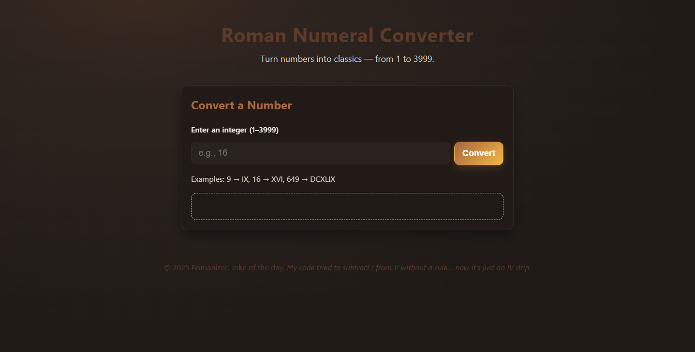

# Roman Numeral Converter

A responsive Roman numeral converter that transforms any integer from **1 to 3999** into its Roman numeral equivalent.

Built with semantic HTML, custom CSS, and vanilla JavaScript to demonstrate algorithmic thinking, validation logic, and accessible UI design.

## Live Demo
https://sharpsanders.github.io/roman-numeral-converter/



---

## Features

- Converts numbers **1–3999** into proper Roman numerals
- Full validation:
  - Empty input
  - Non-numeric values
  - Decimals
  - Out-of-range numbers
- Keyboard support (press **Enter** to convert)
- Dynamic output rendering
- Auto-updating footer year
- Light/Dark mode support using `prefers-color-scheme`
- Accessible design:
  - `aria-live="polite"` result updates
  - Skip-to-content link
  - Mobile-friendly numeric input

---

## Tech Stack

- **HTML5** – semantic structure + accessibility
- **CSS3** – responsive layout, custom theme, fluid scaling
- **JavaScript (ES6+)** – validation, algorithm, DOM updates

No frameworks. No libraries.

---

## How It Works (Algorithm Overview)

The converter uses a **descending-value subtraction algorithm**.

```js
const pairs = [
  { val: 1000, sym: "M" },
  { val: 900,  sym: "CM" },
  { val: 500,  sym: "D" },
  { val: 400,  sym: "CD" },
  { val: 100,  sym: "C" },
  { val: 90,   sym: "XC" },
  { val: 50,   sym: "L" },
  { val: 40,   sym: "XL" },
  { val: 10,   sym: "X" },
  { val: 9,    sym: "IX" },
  { val: 5,    sym: "V" },
  { val: 4,    sym: "IV" },
  { val: 1,    sym: "I" },
];

let result = "";
let n = num;

for (const { val, sym } of pairs) {
  while (n >= val) {
    result += sym;
    n -= val;
  }
  if (n === 0) break;
}

return result;
The algorithm subtracts the largest Roman numeral values first and appends symbols until the number is reduced to zero, ensuring correct Roman numeral formation.

Validation Logic
The application prevents:

Empty submissions

Non-numeric input

Decimal values

Numbers less than 1

Numbers greater than 3999

Clear, user-friendly error messages are displayed dynamically.

Project Structure
roman-numeral-converter/
├── index.html
├── styles.css
└── script.js
What I Practiced
Writing efficient transformation algorithms

Defensive input validation

Separating logic from UI rendering

Using aria-live for accessible dynamic updates

Designing responsive, theme-based UI with pure CSS

Possible Improvements
Conversion history

Copy-to-clipboard result

Bidirectional conversion (Roman → Number)

Result animation

Built by Trevyn Sanders
Better Endeavors LLC